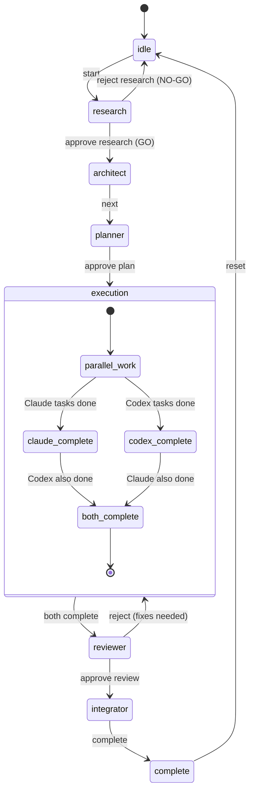
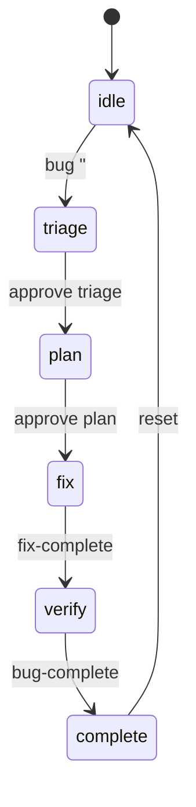
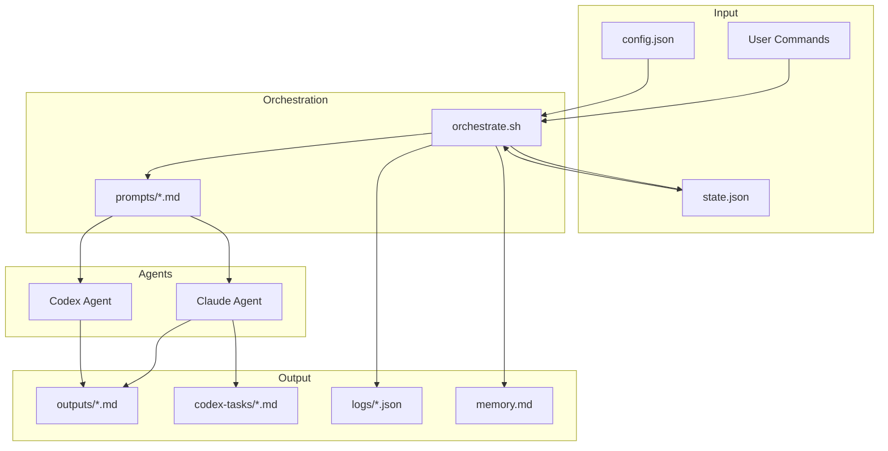

# Architecture

System architecture and design of the multi-agent orchestration workflow.

---

## Overview

The orchestration system coordinates multiple AI agents (Claude + Codex) to execute software development workflows. It provides:

- **State Management** - JSON-based state tracking across sessions
- **Phase Transitions** - Structured workflow with checkpoints
- **Memory System** - Cross-session learning accumulation
- **Logging & Analytics** - Workflow metrics and aggregate statistics

---

## System Components

```
┌─────────────────────────────────────────────────────────────────────┐
│                        PROJECT ROOT                                  │
├─────────────────────────────────────────────────────────────────────┤
│  CLAUDE.md              Project-level AI instructions                │
│  docs/                  Documentation and plans                      │
│    └── plans/           Active and archived execution plans          │
│                                                                      │
│  .agents/               Orchestration system                         │
│    ├── orchestrate.sh   Main workflow script                         │
│    ├── state.json       Current workflow state                       │
│    ├── config.json      Project configuration                        │
│    ├── memory.md        Cross-session learnings                      │
│    ├── prompts/         Role-specific AI prompts                     │
│    ├── outputs/         Phase outputs (research.md, etc.)            │
│    ├── codex-tasks/     Parallel tasks for Codex                     │
│    └── logs/            Workflow logs and analytics                  │
└─────────────────────────────────────────────────────────────────────┘
```

---

## Workflow State Machine

### Feature Workflow



### Bug-Fix Workflow



---

## Data Flow



---

## State Schema

The `state.json` file tracks all workflow state:

```json
{
  "type": "feature | bugfix",
  "feature": "feature-name",
  "bug": {
    "title": "Bug title",
    "issue_number": 123,
    "severity": "critical | major | minor"
  },
  "branch": {
    "main": "feature/name",
    "codex": "codex/name"
  },
  "phase": "current-phase",
  "phases": {
    "research": { "status": "pending|in_progress|complete", "approved": false },
    "architect": { "status": "pending|in_progress|complete" },
    "planner": { "status": "pending|in_progress|complete", "approved": false },
    "execution": {
      "claude": { "status": "pending|in_progress|complete" },
      "codex": { "status": "pending|running|complete", "tasks_total": 0 }
    },
    "reviewer": { "status": "pending|in_progress|complete", "approved": false },
    "integrator": { "status": "pending|in_progress|complete", "merged": false }
  },
  "autonomous": {
    "enabled": false,
    "expires_at": null
  },
  "model_hint": {
    "phase": "current",
    "recommended_model": "haiku | sonnet | opus"
  },
  "metrics": {
    "started_at": "ISO timestamp",
    "completed_at": "ISO timestamp"
  },
  "history": [
    { "timestamp": "...", "event": "...", "message": "..." }
  ]
}
```

---

## Agent Roles

### Research Agent
- **Input**: Feature name, existing codebase
- **Output**: `.agents/outputs/research.md`
- **Purpose**: Analyze feasibility, existing solutions, technical approach

### Architect Agent
- **Input**: Research output, codebase
- **Output**: `.agents/outputs/architecture.md`
- **Purpose**: Design system architecture, component interfaces

### Planner Agent
- **Input**: Architecture, research
- **Output**: Plan file + Codex task files
- **Purpose**: Break work into Claude/Codex tasks

### Execution Agents
- **Claude**: Sequential, complex tasks
- **Codex**: Parallel, independent tasks

### Reviewer Agent
- **Input**: All code changes
- **Output**: `.agents/outputs/review.md`
- **Purpose**: Quality gate before integration

### Integrator Agent
- **Input**: Approved changes
- **Purpose**: Merge branches, update docs

---

## File Locking

State file updates use portable `mkdir`-based locking:

```bash
# Acquire lock (atomic on all Unix systems)
mkdir "$STATE_FILE.lockdir"

# Update state
jq '...' "$STATE_FILE" > "$STATE_FILE.tmp"
mv "$STATE_FILE.tmp" "$STATE_FILE"

# Release lock
rmdir "$STATE_FILE.lockdir"
```

This prevents race conditions when Claude and Codex update state simultaneously.

---

## Model Selection

Models are selected based on phase and complexity:

| Phase | Simple | Medium | Complex |
|-------|--------|--------|---------|
| Research | haiku | sonnet | sonnet |
| Architect | opus | opus | opus |
| Planner | sonnet | sonnet | sonnet |
| Execution | haiku | sonnet | opus |
| Reviewer | haiku | sonnet | sonnet |
| Integrator | sonnet | sonnet | sonnet |

---

## Extension Points

### Adding New Phases

1. Add phase to `state.json.template`
2. Create prompt in `.agents/prompts/<phase>.md`
3. Add transition logic in `orchestrate.sh`
4. Update `show_next_command()` hints

### Adding New Commands

1. Add case in command router (bottom of `orchestrate.sh`)
2. Implement function
3. Add to help text
4. Document in `docs/COMMANDS.md`

### Custom Configurations

Edit `.agents/config.json`:
- `models`: Override default model selection
- `paths`: Custom directory locations
- `settings`: Feature flags

---

## Security Considerations

- State file contains no secrets
- Git operations use user's credentials
- Codex runs in sandboxed environment
- File locking prevents state corruption

---

## Performance

- **State updates**: ~10ms (file I/O + jq)
- **Phase transitions**: ~100ms
- **Codex dispatch**: Varies by task count
- **Full workflow**: 30min - 4hrs typical

---

## Related Documentation

- [Getting Started](GETTING_STARTED.md) - Quick start guide
- [Commands Reference](COMMANDS.md) - All commands
- [State Schema](STATE_SCHEMA.md) - Detailed state documentation
- [Troubleshooting](TROUBLESHOOTING.md) - Common issues
