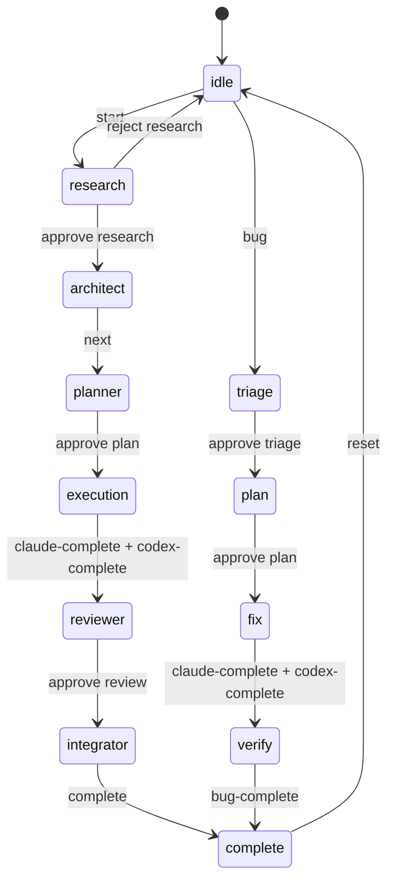

# State Schema Reference

Documentation for `.agents/state.json` structure.

---

## Overview

The state file tracks the current workflow status, phase progress, and execution metadata. It is automatically managed by `orchestrate.sh` commands.

**Location**: `.agents/state.json`

---

## Full Schema

```json
{
  "type": "feature | bugfix",
  "feature": "string | null",
  "bug": {
    "title": "string | null",
    "issue_number": "number | null",
    "issue_url": "string | null",
    "severity": "critical | major | minor | null",
    "branch": "string | null"
  },
  "branch": {
    "main": "string | null",
    "codex": "string | null"
  },
  "phase": "idle | research | architect | planner | execution | reviewer | integrator | complete | triage | plan | fix | verify",
  "phases": {
    "triage": { "status": "pending | in_progress | complete", "output": "string | null", "approved": "boolean" },
    "research": { "status": "pending | in_progress | complete", "output": "string | null", "approved": "boolean" },
    "architect": { "status": "pending | in_progress | complete", "output": "string | null" },
    "planner": { "status": "pending | in_progress | complete", "output": "string | null", "approved": "boolean" },
    "plan": { "status": "pending | in_progress | complete", "output": "string | null", "approved": "boolean" },
    "execution": {
      "status": "pending | in_progress | complete",
      "claude": { "status": "pending | in_progress | complete", "current_task": "string | null" },
      "codex": { "status": "pending | running | complete", "tasks_completed": "number", "tasks_total": "number", "retry_count": "number" }
    },
    "fix": { "status": "pending | in_progress | complete" },
    "verify": { "status": "pending | in_progress | complete", "output": "string | null" },
    "reviewer": { "status": "pending | in_progress | complete", "output": "string | null", "approved": "boolean" },
    "integrator": { "status": "pending | in_progress | complete", "notion_updated": "boolean", "merged": "boolean" }
  },
  "autonomous": {
    "enabled": "boolean",
    "enabled_at": "ISO8601 | null",
    "enabled_by": "string | null",
    "timeout_hours": "number | null",
    "expires_at": "ISO8601 | null",
    "auto_approved": ["string"]
  },
  "model_hint": {
    "phase": "string | null",
    "complexity": "simple | medium | complex",
    "severity": "critical | major | minor | null",
    "recommended_model": "haiku | sonnet | opus",
    "updated_at": "ISO8601 | null"
  },
  "tasks": {},
  "checkpoints": {
    "triage_approved": "boolean",
    "research_approved": "boolean",
    "plan_approved": "boolean",
    "execution_complete": "boolean",
    "review_approved": "boolean",
    "integration_complete": "boolean"
  },
  "history": [
    { "timestamp": "ISO8601", "message": "string" }
  ],
  "metrics": {
    "started_at": "ISO8601 | null",
    "completed_at": "ISO8601 | null",
    "phase_durations": {},
    "total_duration_ms": "number | null"
  }
}
```

---

## Field Descriptions

### Top-Level Fields

| Field | Type | Description |
|-------|------|-------------|
| `type` | string | Workflow type: `feature` or `bugfix` |
| `feature` | string | Feature name (kebab-case), null when idle |
| `bug` | object | Bug-fix specific data |
| `branch` | object | Git branch names |
| `phase` | string | Current workflow phase |
| `phases` | object | Status of each phase |
| `autonomous` | object | Autonomous mode state |
| `model_hint` | object | Recommended model for current phase |
| `tasks` | object | Task tracking (reserved) |
| `checkpoints` | object | Checkpoint approval status |
| `history` | array | Event log |
| `metrics` | object | Workflow timing metrics |

### Bug Object

| Field | Type | Description |
|-------|------|-------------|
| `title` | string | Bug title from user input |
| `issue_number` | number | GitHub issue number |
| `issue_url` | string | GitHub issue URL |
| `severity` | string | `critical`, `major`, or `minor` |
| `branch` | string | Fix branch name |

### Branch Object

| Field | Type | Description |
|-------|------|-------------|
| `main` | string | Main feature branch (`feature/<name>` or `fix/<id>-<name>`) |
| `codex` | string | Codex parallel work branch (`codex/<name>`) |

### Autonomous Object

| Field | Type | Description |
|-------|------|-------------|
| `enabled` | boolean | Whether autonomous mode is on |
| `enabled_at` | ISO8601 | When autonomous mode was enabled |
| `enabled_by` | string | Who enabled it (always `"user"`) |
| `timeout_hours` | number | Configured timeout in hours |
| `expires_at` | ISO8601 | When timeout expires |
| `auto_approved` | array | List of checkpoints auto-approved this session |

### Model Hint Object

| Field | Type | Description |
|-------|------|-------------|
| `phase` | string | Phase this hint applies to |
| `complexity` | string | Task complexity: `simple`, `medium`, `complex` |
| `severity` | string | Bug severity (for bugfix workflows) |
| `recommended_model` | string | `haiku`, `sonnet`, or `opus` |
| `updated_at` | ISO8601 | When hint was last updated |

### Checkpoints Object

| Field | Type | Description |
|-------|------|-------------|
| `triage_approved` | boolean | Triage checkpoint approved (bugfix) |
| `research_approved` | boolean | Research checkpoint approved (feature) |
| `plan_approved` | boolean | Plan checkpoint approved |
| `execution_complete` | boolean | Execution phase complete |
| `review_approved` | boolean | Review checkpoint approved |
| `integration_complete` | boolean | Integration phase complete |

### History Entry

| Field | Type | Description |
|-------|------|-------------|
| `timestamp` | ISO8601 | When event occurred (UTC) |
| `message` | string | Event description |

### Metrics Object

| Field | Type | Description |
|-------|------|-------------|
| `started_at` | ISO8601 | Workflow start time |
| `completed_at` | ISO8601 | Workflow completion time |
| `phase_durations` | object | Duration per phase in ms |
| `total_duration_ms` | number | Total workflow duration in ms |

---

## Phase Values

### Feature Workflow Phases

```
idle → research → architect → planner → execution → reviewer → integrator → complete
```

### Bug-Fix Workflow Phases

```
idle → triage → plan → fix → verify → complete
```

---

## State Diagram



---

## Status Values

| Status | Meaning |
|--------|---------|
| `pending` | Phase not started |
| `in_progress` | Phase currently active |
| `running` | Codex tasks executing |
| `complete` | Phase finished |

---

## Example: Idle State

```json
{
  "type": "feature",
  "feature": null,
  "phase": "idle",
  "phases": {
    "research": { "status": "pending", "approved": false }
  },
  "checkpoints": {
    "research_approved": false
  },
  "history": []
}
```

## Example: Mid-Execution State

```json
{
  "type": "feature",
  "feature": "add-authentication",
  "branch": {
    "main": "feature/add-authentication",
    "codex": "codex/add-authentication"
  },
  "phase": "execution",
  "phases": {
    "research": { "status": "complete", "approved": true },
    "architect": { "status": "complete" },
    "planner": { "status": "complete", "approved": true },
    "execution": {
      "status": "in_progress",
      "claude": { "status": "in_progress", "current_task": "2.3" },
      "codex": { "status": "running", "tasks_completed": 1, "tasks_total": 3 }
    }
  },
  "checkpoints": {
    "research_approved": true,
    "plan_approved": true,
    "execution_complete": false
  },
  "model_hint": {
    "phase": "execution",
    "complexity": "medium",
    "recommended_model": "sonnet"
  },
  "history": [
    { "timestamp": "2026-02-01T10:00:00Z", "message": "Started feature: add-authentication" },
    { "timestamp": "2026-02-01T10:30:00Z", "message": "Research approved - proceeding to build" },
    { "timestamp": "2026-02-01T11:00:00Z", "message": "Architect phase complete - moving to Planner" },
    { "timestamp": "2026-02-01T11:45:00Z", "message": "Plan approved - starting execution" }
  ]
}
```

---

## Reading State

### From Shell

```bash
# Get current phase
jq -r '.phase' .agents/state.json

# Get feature name
jq -r '.feature' .agents/state.json

# Get model hint
jq -r '.model_hint.recommended_model' .agents/state.json

# Check if autonomous mode is enabled
jq -r '.autonomous.enabled' .agents/state.json
```

### From Orchestrate.sh

The script provides helper functions:

```bash
# These are used internally by orchestrate.sh
get_state '.phase'           # Returns phase value
get_state '.feature'         # Returns feature name
get_state '.bug.severity'    # Returns bug severity
```

---

## Modifying State

**Warning**: Do not manually edit state.json. Use orchestrate.sh commands.

```bash
# Wrong - direct edit
echo '{"phase": "complete"}' > .agents/state.json  # DO NOT DO THIS

# Right - use commands
./orchestrate.sh complete
./orchestrate.sh reset
```

The script uses file locking (`mkdir` based) to prevent race conditions when multiple processes access state.
